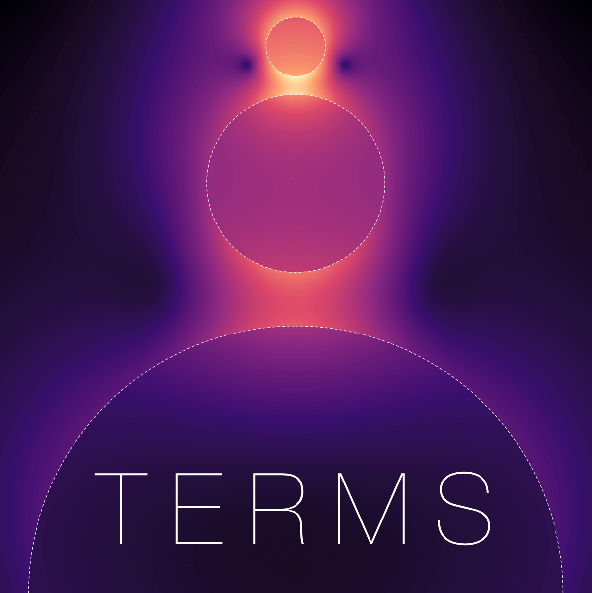

---
output:
  github_document
bibliography: publications.bib
csl: acs-photonics.csl
---

<!-- Index.md is generated from Index.Rmd. Please edit that file -->

```{r, include = FALSE}
knitr::opts_chunk$set(
  collapse = TRUE,
  comment = "#>",
  fig.path = "man/figures/Index-",
  out.width = "100%"
)
```

# TERMS 

\usepackage{mathrsfs}
\newcommand{\ldoc}{\mathscr{C}}
\newcommand{\ldocbar}{\overline{\mathscr{C}}}
\newcommand{\ldocoa}{\langle\mathscr{C}\rangle}
\newcommand{\ldocoabar}{\langle\overline{\mathscr{C}}\rangle}

TERMS stands for **T**-matrix for **E**lectromagnetic **R**adiation with **M**ultiple **S**catterers — it is a Fortran program to simulate the near-field and far-field optical properties of collections of particles. TERMS solves rigorously the Maxwell equations via the superposition *T*-matrix method, where incident and scattered fields are decomposed into a basis of multipolar electric and magnetic spherical waves.

In a multiple-scattering problem the net field exciting a given particle is composed of the incident field plus the scattering contribution from neighbouring particles, restulting in a coupled system of equations to be solved for the total fields. TERMS implements several algorithms to describe the self-consistent electromagnetic interaction between multiple scatterers, and from there compute optical properties such as absorption, scattering, extinction, circular dichroism, as well as near-field intensities and the local degree of optical chirality.

By describing the incident and scattered fields in a basis of spherical waves the *T*-matrix framework lends itself to analytical formulas for orientation-averaged quantities such as far-field cross-sections and near-field intensities, greatly reducing the computational time needed to simulate particles and systems of particles in random orientation.

### Features
  
The possible computations are divided into three main modes:

- Far-field quantities (absorption, scattering, extinction, circular dichroism) for multiple wavelengths and angles of incidence, as well as orientation-averages
- Near-field calculations for multiple wavelengths and incident angles, also computing the local degree of chirality, as well as orientation-averages
- Stokes parameters and differential scattering cross-sections for multiple incidence or scattering angles

The computational cost scales with the size of the linear system, proportional to the number of particles $N_\text{p}$, and to the square of the maximum multipolar order $N_\text{max}$. On a typical PC we may treat up to $\sim\text{500}$ particles with $N_\text{max}=\text{1}$, and a dimer with $N_\text{max}$ up to $\sim \text{60}$.

Notable features of TERMS include:

- Incident plane waves along arbitrary directions, with linear or circular polarisation
- Built-in calculation of individual *T*-matrices for coated spheres; import of general *T*-matrices from other programs (e.g. [SMARTIES](https://www.victoria.ac.nz/scps/research/research-groups/raman-lab/numerical-tools/smarties))
- Built-in dielectric functions for common materials such as Au, Ag, Al, Cr, Pt, Pd, Si, and Water, or from tabulated values
- Per-layer absorption in layered spheres
- Orientation-averaging of far-field cross-sections, as well as linear and circular dichroism
- Near-field maps of electric and magnetic field components, $|\mathbf{E}|^2$, $|\mathbf{E}|^4$, $\ldoc\propto\Im(\mathbf{E}^*\cdot\mathbf{B})$
- Calculation of the global cluster *T*-matrix
- "Masking" of specific multipolar orders
- Calculation of Stokes parameters, phase matrix, differential scattering
- Plain text or HDF5 I/O format
- Possible compilation in quad-precision

### System requirements

*   Fortran 90 compiler
*   Cmake
*   (optional) HDF5 library
*   (optional) LAPACK

The electromagnetic field is expanded in the basis of vector spherical waves, with the Bessel/Hankel functions computed using [TOMS644](http://www.netlib.org/toms-2014-06-10/644) library (source included in **TERMS**). Determining the collective scattering amounts to either solving or inverting a large linear system, which is done using [LAPACK](http://www.netlib.org/lapack/). All the relevant LAPACK routines are included in **TERMS**, but it is recommended to link with your system installed BLAS/LAPACK at compilation stage, because it can enable multi-threading during runtime.  
Results are output in plain text files, or, alternatively, in `HDF5` data format, which requires suitable `hdf5` libraries to be available on your system.

### Compilation

We recommend using the cross platform compilation tool [cmake](https://cmake.org/), to resolve all dependencies for your system. From within the `build/` directory, type

```
> cmake ..
> make
```
to produce the executable `terms`. Note: if Cmake doesn't find hdf5 (or another library path) by default, you may need to export it explicitly beforehand. For example on MacOS, the following has proved useful:

```
# brew install hdf5
export HDF5_ROOT=/usr/local/Cellar/hdf5/1.12.0_3/
```

Alternatively, a minimal build script is available in the `build/` directory; the program can be compiled by executing `bash buildTERMS.sh` from a Linux terminal with [bash](https://www.gnu.org/software/bash/). Edit 'buildTERMS.sh' to specify a compiler other than [GFortran](https://gcc.gnu.org/wiki/GFortran). 


#### Downloading the code

We recommend downloading the [latest release here](https://github.com/nano-optics/terms/releases) [`terms_code_0.9.9(.zip|.tar)`]. You can also browse/clone/fork the [entire repository](https://github.com/nano-optics/terms), but note that it contains many files used to generate the website, which are not relevant for using TERMS.

### The input file

When running the stand-alone executable, main input parameters are read from a plain text input file (line by line and from left to right). Each line is interpreted as a sentence and split into space-separated words. The first (left-most) word is interpreted as a keyword, and the subsequent words as arguments for that keyword. In each sentence, text from the first word starting with the hash character (`#`) is interpreted as a human-readable comment and thus ignored by the program. All the supported keywords and corresponding arguments are [documented on this page](http://nano-optics.ac.nz/terms/articles/Keywords.html). The order of keywords generally doesn't matter, with just two exceptions: `ModeAndScheme` must be the first keyword, and `Scatterers` must be the last. Two examples of input files are provided in the `/test` directory. 


## Citing TERMS

If you use TERMS, please cite the following user guide, as well as other publications listed below if relevant: 
<div style="display: none;">
@Schebarchov:2021wc, @Schebarchov:2021ut, @Somerville:2016aa, @schebarchov2019mind, @Lee:2020aa, @fazel2021orientation, @Fazel-Najafabadi:2021ud, @Fazel-Najafabadi:2022ud, Herran:2021wh
</div>


  
