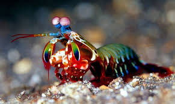

In this example we simulate the field profile of coupled whispering-gallery modes as a function of wavelength. The system consists of two diamond spheres of radius 500 nm separated by a 1 nm gap. Light is incident normal to the screen, with circular polarisation.

```{r results="asis",echo=FALSE}
cat('
<svg>
  <defs>
    <clipPath id="clipping">
      <ellipse cx="150" cy="100" rx="150" ry="50">
    </clipPath>
  </defs>
</svg>

<style>
video {
  top: -400px;
  left: 50px;
  position: relative;
  display: inline-block;
  
  clip-path: url(#clipping);
  /* ie7 inline-block support */
  *display: inline;
  *zoom: 1;
}

#over {
  position: relative;
  width: 600px;
}
</style>
')
```

<div class="video-container">

  <div id="over"></div>
  <video loop autoplay muted playsinline width="300" height="200">
    <source src="mantis.mp4" type="video/mp4">
  </video>
</div>

If it remains unclear what the whispering is about, the interested reader may wish to consult the following references:

- [_Dynamic polarisation vision in mantis shrimps._](https://doi.org/10.1038/ncomms12140) Ilse M. Daly, Martin J. How, Julian C. Partridge, Shelby E. Temple, N. Justin Marshall, Thomas W. Cronin & Nicholas W. Roberts. _Nature Communications_ vol. **7**, 12140 (2016) 

- [**ALL GLORY TO THE HYPNOTOAD**](https://futurama.fandom.com/wiki/Hypnotoad) 
