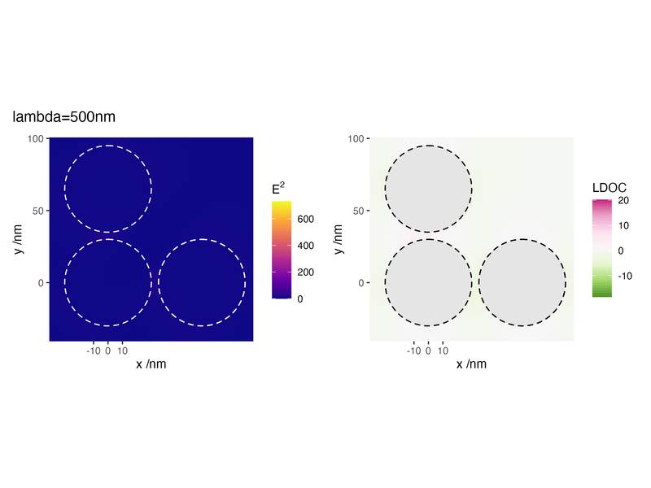

```{r demo, message=FALSE, echo=FALSE}
library(knitr)
library(terms)
library(ggforce)
options(cli.num_colors = 1)
theme_set(theme_grey())
opts_chunk$set(echo = FALSE, warning =FALSE,
               message=FALSE, comment='', 
               tidy=FALSE, cache = FALSE)
do.call(read_chunk, list(path = "_run.R"))
```

## Objective

This example illustrates the calculation of near-field calculations for multiple wavelengths. The structure consists of a chiral tetramer of gold spheres in water. The wavelength is varied from 500 to 700 nm, and we map the electric field intensity and normalised local degree of chirality in the xy plane around the structure, which is illuminated with linear polarisation at 45 degrees in the xy plane and wavevector along z. Note that a small value of Nmax is used to keep the calculation time short; for accurate results a larger value should be used.

```{r show_cluster, echo=FALSE, results='asis', message=FALSE}
library(terms)
cat('  <style>
.x3d_scene {
float:right;
margin:0em;
 }
  </style>')

ge <- get_geometry('input')
cl <- cluster_geometry(ge)

terms::x3d_scene(cl, viewpoint=c(200,100,100), width = "200px", height = "150px") 
```

This simulation uses the following `input` file
```{bash input}
cat input
```

The results contain the near-field data for all wavelengths in long format

```{r read}
```

## Intensity

```{r intensity,fig.height=2}
```

## LDOC

```{r ldoc,fig.height=2}
```


## Animation

The same data can also be visualised as an animation by mapping the wavelength to time


```{r echo=FALSE, fig.show="hold", out.width='100%'}

```


-----

```{r cleanup}
```
_Last run: `r format(Sys.time(), '%d %B, %Y')`_
