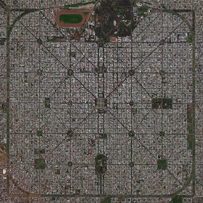
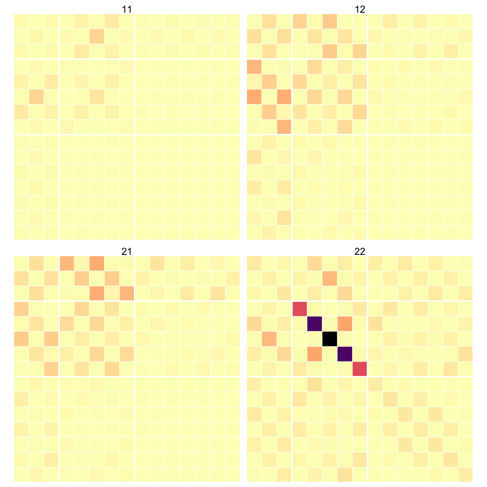
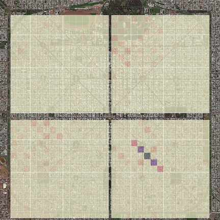

```{r demo, message=FALSE, echo=FALSE}
library(knitr)
library(terms)
options(cli.num_colors = 1)
theme_set(egg::theme_article())
opts_chunk$set(echo = FALSE, warning =FALSE,
               message=FALSE, comment='', 
               tidy=FALSE, cache = FALSE)
do.call(read_chunk, list(path = "_run.R"))
```


```{r echo=FALSE, fig.show="hold", out.width='30%', fig.cap='Aerial view of La Plata; a T-matrix; the two overlayed'}



```

## Objective

This example illustrates the syntax to select specific multipole orders from each individual particle T-matrix. We also display the collective T-matrix of a cluster.


```{r show_cluster, echo=FALSE, results='asis', message=FALSE}
library(terms)
cat('  <style>
.x3d_scene {
float:right;
margin:0em;
 }
  </style>')

ge <- get_geometry('input')
cl <- cluster_geometry(ge)
terms::x3d_scene(cl, viewpoint=c(0,0,200), width = "200px", height = "150px", default_material='gold')
```

```{r load, cache=FALSE}
```

## Unmasked matrices

We first start with a simulation using the following `input` file

```{bash run}
cat input
```

where we run everything at a single wavelength to make it easier to display the different matrices.

The command to run the example is simply

```
../../build/terms input > log
```

```{r fun}
```

The output consists of the standard far-field cross-sections in various files, with the addition of 3 files as requested: 

- `prestagedA.txt` (hard-coded name, single wavelength)
- `stagedA_bal.txt` (hard-coded name, single wavelength)
- `collective_tmat.txt`  (user-defined name, can contain multiple wavelengths)

```{r staged}
```

The "prestaged" matrix combines together the individual T-matrices for each scatterer, along the block-diagonal. Here we recognise that each particle's T-matrix is dominated at this wavelength by the electric dipole resonance in the block $T_{22}$. The first spheroid stays aligned with the lab frame, and is therefore diagonal, while the second particle, being rotated, mixes the different m values of the electric dipole.

The "staged" matrix presents the translation matrices involved in the off-diagonal blocks of the collective linear system solved by TERMS. 

```{r collective}
```

Once TERMS has solved the multiple scattering problem, it can export the collective T-matrix of the whole cluster. In contrast to the T-matrix of a single spheroid, the matrix is fully dense due to the interaction between the two particles. 

## Masked matrices

With this default situation in mind, we now turn to the ability to select specific multipoles in the input T-matrices. For instance, we'll use the following input file to select only the electric dipole term, which was already dominant because of the plasmon resonance.

```{bash run2}
cat input_EE1
```

```{r staged2}
```

As a last example we now select the electric quadrupole, and mask all other orders,

```{bash run3}
cat input_EE2_MM0
```

```{r staged3}
```

With these input T-matrices being masked without the strong electric dipole component, the collective T-matrix is now very different.

```{r collective3}
```


-----

```{r cleanup}
```
_Last run: `r format(Sys.time(), '%d %B, %Y')`_
