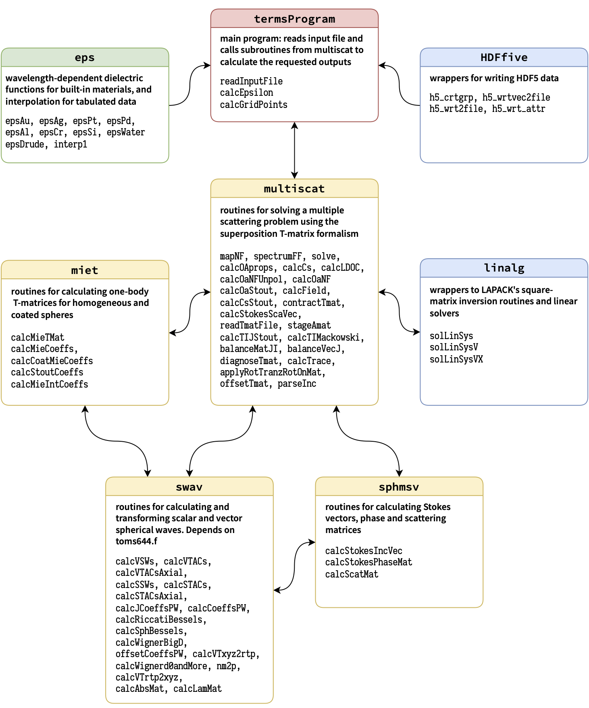

<script type="text/x-mathjax-config">
MathJax.Hub.Config({
TeX: { equationNumbers: { autoNumber: "AMS" } }
});
</script>


{width="100%"}

### [Main program `termsProgram`](https://github.com/nano-optics/terms/blob/main/src/termsProgram.f90) {#main-program-termsprogram .unnumbered}

`termsProgram` is the main module, with subroutines listed below; it
reads the keywords and their corresponding values in the input file and
then calls different subroutines of `multiscat` module for the
calculation of requested outputs.

-   `readInputFile(inputfile)`\
    Reads the input file containing specific keywords and the
    corresponding parameter values.

-   `errorParsingArguments(keyword)`\
    If there is an error with the parameter values assigned to a
    keyword, this subroutine informs the user and stops the program.

-   `calcEpsilon()`\
    Updates the `escat` array storing the relative dielectric
    function(s) for each scatterer evaluated at the specified
    wavelengths.\
    `escat` is an array for which the number of rows, columns and the
    3$^{rd}$ dimension correspond to the number of shells, scatterers,
    and wavelengths, respectively.

-   `calcGridPoints(points)`\
    For a near-field calculation, this subroutine calculates the grid
    points based on the number of steps, lower and upper values along
    the desired axes.\
    `points(3, nGridPoints)` is an in/output matrix storing the
    cartesian coordinates $(x,y,z)$ of the grid points.

-   `sentence2words(sentence, words, nwords_)`\
    Reads each line of the input file as a sentence and splits it into
    space-separated words.\
    `sentence`, `words` are in/output character arrays, and `nwords_` is
    an optional output integer containing the number of words in the
    sentence.

-   `dumpNFs2TXTFile(filename, incidences, Epower, wavelen, work, Ef, p_label)`\
    Exports electric and magnetic near fields into a plain text file.
    `filename` is the name of the text file.
    `incidences, Epower, wavelen, work` are the incidence angles,
    selected power for mapping fields, wavelength, and near-field
    quantities, respectively. `Ef` is a logical flag which selects
    either electric field or magnetic field. `p_label` is an integer
    array indexing the position of each grid point, whether it is inside
    the surrounding medium or a particle, and in which layer.

-   `dumpNFs2HDF5File(fname, groupname, filename, incidences, Epower, wavelen, work, p_label)`
    Exports electric and magnetic near fields into a HDF5 file.
    `filename`, `fname`, `groupname` are the names of the HDF5 file,
    group, and subgroup name, respectively.
    `incidences, Epower, wavelen, work` are the incidence angles,
    selected power for mapping fields, wavelength, and near-field
    quantities, respectively. `Ef` is a logical flag which selects
    either electric field or magnetic field. `p_label` is an integer
    array indexing the position of each grid point, whether it is inside
    the surrounding medium or a particle, and in which layer.

-   `countLines(filename) result(nlines)`\
    Counts lines in a text file.

### [`multiscat` module](https://github.com/nano-optics/terms/blob/main/src/multiscat.f90) {#multiscat-module .unnumbered}

This module consists of a mix of high-level, core, low-level and
supplementary routines for solving a multiple scattering problem using
the *T*-matrix formalism. We list below the subroutines of the
`multiscat` module with a brief explanation. A list of common arguments
and their brief description is at the end of this section. The other
arguments are explained after each subroutine.

-   `mapNF(ncut, wavelen, inc,ehost, geometry, scheme, tfiles_, escat_, nselect_, verb_, noRTR_, dump_oaE2, dump_oaB2, field, Bfield, N_OC, orAvextEB_int, oa_ldoc, p_label)`\
    Calculates the electric and magnetic near fields, and normalised
    optical chirality ($\overline{\mathscr{C}}$) for a multiple
    scattering problem, for different incidence directions and
    wavelengths, as well as the orientation-averaged value of external
    $\langle|\mathbf{E}|^2\rangle, \langle|\mathbf{B}|^2\rangle$ and
    $\langle\overline{\mathscr{C}}\rangle$.
    `escat_, tfiles_, nselect_, verb_, noRTR_` are optional inputs.
    `dump_oaE2, dump_oaB2` are logical flags selecting whether the
    orientation-averaged values $\langle|\mathbf{E}|^2\rangle$ and
    $\langle|\mathbf{B}|^2\rangle$ will be calculated, respectively.

-   `spectrumFF(ncut, wavelen, ehost, geometry, scheme, escat_, tfiles_, nselect_, noRTR_, verb_, sig_oa_, sig_, sig_abs_, jsig_abs_oa)`\
    Calculates cross-section spectra for (multiple) fixed orientations,
    partial absorptions, and orientation-averaged cross-sections for a
    particle cluster. *T*-matrices for individual scatterers are either
    constructed using Mie theory or read from an optional argument
    `tfiles_`. `escat_, tfiles_, nselect_, verb_, noRTR_` are optional
    inputs. `jsig_abs_oa` contains the orientation-averaged absorption
    cross-section of each particle (valid for homogeneous spheres only,
    at present).

-   `solve(wavelen, ehost, geometry, nselect_, scheme_, verb_, noRTR_, TIJ, cJ_, cJint_, csAbs_, ierr_ )`\
    This routine is the crux of [terms]{.smallcaps} and solves a given
    multiple scattering problem by operating in a specified scheme.
    `TIJ` is an in/output argument, `cJ_, cJint_, csAbs_` are optional
    in/output arguments, `nselect_, scheme_, verb_, noRTR_` are optional
    inputs, and `ierr_` is an optional output. `TIJ`
    ($l_{max}\times \text{nscat}$, $l_{max}\times\text{nscat}$) as the
    input argument stores the *T*-matrix of nonspherical particles as
    the diagonal blocks of the matrix, or dielectric values of different
    shells for spherical particles as the diagonal elements of the
    matrix. `nscat` is the number of scatterers. This subroutine updates
    and returns `TIJ` for the whole system as the output.
    `cJ_(nscat x l_{max}, 2, nfi)` as the input argument contains
    details of the incident field and as a output argument contains
    incident plane wave coefficients in the first column and scattering
    coefficients in the second column. `nfi` is the number of incident
    angles. `cJint_(nscat x l_{max}, 4, 2)`: contains the regular and
    irregular field coefficients for each concentric region inside
    spherical scatterers. `csAbs_(nscat,4)`: contains absorption cross
    section inside each shell of each spherical scatterer.

-   `stageAmat(scatXYZ, scatMiet, rtr, right_, balance_, verb_, A, Tmats_)`\
    Stages a pre-staged matrix $A$.\
    `A (l_{max} x nscat, l_{max} x nscat)`: an in/output matrix, which
    must contain 1-body *T*-matrices in the diagonal blocks on input and
    is a pre-staged matrix on the output; `right_, balance_, verb_` are
    optional inputs; `Tmats_(l_{max}, l_{max}, nscat)`: an optional
    output matrix which contains the 1-body *T*-matrix of each particle.
    `balance_`: a logical input argument which determines whether
    balancing is applied or not.

-   `calcTIJStout(scatXYZ, scatMiet, rtr, TIJ)`\
    Calculates the scatterer-centred *T*-matrix using the recursive
    scheme presented in Stout. `TIJ` is an in/output argument.
    `TIJ(l_{max} x nscat, l_{max} x nscat)` as the input argument stores
    the *T*-matrix of nonspherical particles as the diagonal blocks, or
    dielectric values of different shells for spherical particles as
    diagonal blocks.

-   `calcTIMackowski(scatXYZ, scatMiet, rtr, TIJ)`\
    Calculates the cluster's *T*-matrix using Mackowski & Mishchenko's
    formulation. `TIJ` is an in/output argument.
    `TIJ(l_{max} x nscat, l_{max} x nscat)` as the input argument stores
    the *T*-matrix of nonspherical particles as the diagonal blocks, or
    dielectric values of different shells for spherical particles as
    diagonal blocks. The output `TIJ` is the scatterer-centred
    *T*-matrices calculated using Mackowski & Mishchenko's
    scheme.

-   `balanceMatJI(j, jregt, iregt, i, rev_, mnq_, Mat)`\
    Performs balancing on a matrix (`Mat`) using two weights (indexed by
    $j$ and $i$). `Mat` is here taken as relating two vectors of VSWF
    coefficients, $c_j$ (centred at $j$) and $c_i$ (centred at $i$),
    such that $c_j = \text{Mat}\, c_i$. Logical inputs `jregt` and
    `iregt` specify whether $c_j$ and $c_i$ are regular or not. `Mat` is
    an in/output argument.

-   `balanceVecJ(j, jregt, rev_, Vec)`\
    Performs balancing on a single vector (`V`) with a weight indexed by
    $j$. `V` corresponds here to the VSWF coefficients of particle $j$.
    `Vec` is an unbalanced/ balanced vector as the in/output argument.
    `j` specifies the scatterer.

-   `calcCsStout(scatXYZR, aJ, fJ, nmax2_, tol_, verb_, sig)`\
    Calculates the extinction, scattering and absorption cross-sections
    from the incident and scattered coefficients using the Stout
    formulae. `nmax2_, tol_, verb_` are optional inputs and
    `sig` is an in/output matrix.

-   `calcCs(scatXYZR, inc, fJ, nmax2_, tol_, verb_, sig)`\
    Calculates the extinction, scattering and absorption cross-sections
    from the incident and scattered coefficients which are collapsed to
    the common origin. Depending on the dimension of the `sig`, each
    cross-section is either just a total sum, or resolved into
    contributions from the multipole orders. `inc`: a vector of
    incidence angles.

-   `calcOAprops(Tmat, rtol_, sigOA, verb_)`\
    Calculates orientation-averaged cross-sections and circular
    dichroism (CD) by transforming the *T*-matrix (`Tmat`) from
    \"parity\" (M--N) basis to \"helicity\" (L--R) basis, following
    Ref. . `rtol_` is an optional input, `verb_` is an optional output,
    and `sigOA` is an in/output matrix containing orientation-averaged
    cross-sections and CD in each column for $n=1, \dots, n_{max}$.

-   `contractTmat(Tin, scatXYZR, rtr, mack_, Tout, verb_)`\
    Combines the scatterer-centred *T*-matrices into a common origin;
    the output will be the collective *T*-matrix (`Tout`). `verb_` is an
    optional in/output, `mack_` is an optional logical input to
    calculate the collective *T*-matrix based on Mackowski &
    Mishchenko's scheme.

-   `alphaTensor(T, Alpha)`\
    Conversion of $l\leq 3$ spherical multipoles of the *T*-matrix $T$
    into cartesian multipoles (tensor `Alpha`), following formulas for
    'Higher-Order Polarizability Tensors' in Mun. This
    function is called when the keyword `DumpCollectiveTmatrix` is
    present, and outputs a file `alpha_col.txt` in the working
    directory.

-   `diagnoseTmat(mode_, verb_, Tmat)`\
    Determines the value of $n \leq n_{max}$ when
    $\operatorname{Tr}(\Re{(\text{Tcol})})$ converges to
    $\text{rtol\_G}:=10^{-\text{ncut(3)}}$. If mode\_ $> 0$, also tests
    for the general symmetry, which applies to all *T*-matrices. (See
    equation 5.34 on p. 121 of Mishchenko).

-   `calcOaStout(TIJ, scatXYZ, verb_, sigOA, cdOA_, jAbsOA)`\
    Calculates the orientation-averaged extinction and scattering
    cross-sections defined in equations 44 and 47 of Stout.
    The absorption cross-section is then deduced as the difference.
    `TIJ` is the collective *T*-matrix, `sigOA(3)` contains
    orientation-averaged extinction and scattering cross-sections, and
    `cdOA_` is an optional output containing the corresponding values of
    CD. `jAbsOA`: contains the orientation-averaged absorption
    cross-section for each particle.

-   `applyRotTranzRotOnMat(vtacs, bigdOP, rightOP, mat)`\
    Performs the factorised translation of *T*-matrices when changing
    origin. Instead of a single multiplication of a *T*-matrix by a
    dense matrix containing the general translation-addition
    coefficients, this routine executes three multiplications by sparse
    matrices representing 1) a rotation, 2) a translation along the
    z-axis; and 3) an inverse rotation. This is meant to be more
    efficient when high multipole orders are included.\
    `vtacs(2x pmax,2 x pmax)`: axial VTACs with $(m,n,q)$ indexing,
    `bigdOP(pmax, pmax)`: optional input for rotation, `rightOP`: an
    optional logical input argument for applying the product from the
    right. `mat`: a non/translated matrix as the in/output.

-   `calcField(r, geometry, ipwVec, ipwE0, scaCJ, intCJreg_, intCJirr_, scatK_, verb_, reE, imE, reB, imB, reE_sca,imE_sca, reB_sca,imB_sca, p_label)`\
    Calculates the electric and magnetic near-field values at the
    determined grid points.\
    `r`: a matrix containing the coordinates of the grid points;
    `ipwVec(3)`,`ipwE0(3)`: contain the wavevector and amplitude of the
    incident field, respectively; `scaCJ`: a vector containing
    scattering coefficients, `intCJreg_, intCJirr_`: contain the regular
    and irregular parts of the incident field coefficients transformed
    to the origin of each particle, respectively, `scatK_` is the
    wavenumber in the host medium, and
    `reE, imE, reB, imB, reE_sca,imE_sca, reB_sca,imB_sca`: contain
    real(re) and imaginary(im) parts of the total electric (E) and
    magnetic (B) fields and the scattered field values at the grid
    points.

-   `dumpTmat(tmat, filename, lambda, eps_med, tol_, verb_)`\
    Routine for dumping the collective *T*-matrix (`tmat`) to a file in
    the format:

    ::: {.center}
    `s, s’, n, n’, m, m’, T_re, T_im`
    :::

    `filename` is an argument of type character corresponding to the
    name of the output file; `lambda`: the value of wavelength;
    `eps_med`: the dielectric value of the host medium.

-   `dumpMatrix(mat, ofile, tolOP, verb_)`\
    Outputs matrix `mat` to a desired optional tolerance (`tolOP`).
    `ofile`: the name of the output file.

-   `offsetTmat(off, miet, rtr, right, bigD_, useD_, balJI_, Tmat)`\
    Offsets the supplied *T*-matrix `Tmat` by `off`, which can be either
    a square matrix of VTACs or a (note: complex!) displacement vector
    $k\mathbf{r}$(3) from which VTACs will be generated. Regular or
    irregular VTACs will be generated depending on whether
    $k\mathbf{r}$(3) is purely real or purely imaginary. If the logical
    input `miet` is true, Tmat will be treated as diagonal. If the
    logical input `rtr` is true, then offsetting will be based on
    factorised translation. If the logical input `right` is true, then
    offsetting will be done by post-multiplying Tmat from the right.
    `balJI_` triggers balancing of the VTACs and the
    *T*-matrices individually, before offsetting, but currently works
    only without factorised translation.

-   `readTmatFile(filename, unit, wavelen, verb_, Tmat)`\
    Reads a *T*-matrix from the input file (`filename`) and import it
    into the matrix `Tmat`. `unit`: an integer indexing the name of the
    *T*-matrix file. `wavelen` is the value of the wavelength.

-   `parseInc(inc, verb_, inc_dirn, inc_ampl)`\
    Calculates the amplitude and direction vector of the incident plane
    wave based on the input Euler angles ($\alpha, \beta, \gamma$).
    `inc_dirn` and `inc_ampl` are vectors containing the wavevector and
    amplitude of the incident electric field in cartesian coordinates,
    respectively. `inc` is a vector consisting of polarisation type and
    Euler angles of the incidence direction.

-   `calcStokesScaVec(sca_angles, inc2, ncut, wavelen, ehost, geometry, scheme, tfiles_, escat_, nselect_, noRTR_, verb_, StokesPhaseMat, StokesScaVec, diff_sca)`\
    Calculates the Stokes phase matrix (`StokesPhaseMat`), Stokes
    scattering vector (`StokesScaVec`), and differential scattering
    cross-sections (`diff_sca`).\
    `sca_angles` is a matrix of desired scattering angles; if it is not
    specified in the input file, they are taken equal to the incidence
    angles. `inc2` is a matrix containing incidence angles.

-   `calcLDOC(Ef, Bf, verb_, N_OpC)`\
    Calculates the normalised optical chirality
    ($\overline{\mathscr{C}}$) relative to the optical chirality of
    circularly polarised light. `Ef`, `Bf`, and `N_OpC` are matrices
    containing the electric and magnetic field, and
    $\overline{\mathscr{C}}$ values at the grid points, respectively.\

-   `calcOaNFUnpol(r, geometry, TIJ, lambda, ehost, escat, p_label, verb_, orEB2)`\
    Calculates the orientation average of the total external electric
    and magnetic field intensities. `r` is a matrix containing the
    cartesian coordinates of the grid points. `TIJ` is the
    scatterer-centred *T*-matrix of the cluster. `orEB2` is a vector
    containing the value of orientation-averaged external electric and
    magnetic field intensities at the grid points.

-   `calcOaNF(pol_type, r, geometry, TIJ, Oa_OC, ehost, p_label, scatK_, verb_, Oa_EB2)`\
    Calculates the orientation average of normalised optical chirality
    $\langle\overline{\mathscr{C}}\rangle$, and near field intensities
    $\langle |\mathbf{E}_\mathrm{tot}(\it{k}\mathbf{r})|^2\rangle$,
    $\langle |\mathbf{B}_\mathrm{tot}(\it{k}\mathbf{r})|^2\rangle$ for
    circularly polarised incident light. `pol_type` is the polarisation
    type, `r` is a matrix containing the cartesian coordinate of the
    grid points. `TIJ` is the scatterer-centred *T*-matrix of the
    structure.

-   `calcTrace(TRANSA, TRANSB, A, B, tr)`\
    Calculates the trace of a product of two matrices, `op(A)*op(B)`.
    The input characters `TRANSA` and `TRANSB` determine the operation
    `op`, following the convention of [blas]{.smallcaps}' `gemm`.
    Specifically, `op = ’N’` corresponds to $\mathtt{op(A) = A}$ (no
    operation), whereas `op = ’C’` corresponds to
    $\mathtt{op(A) = A^\dagger}$.

```{=html}
<!-- -->
```
-   `RotMatX(ang) result(rotMat)`\
    Calculates a rotation matrix along the x axis using input argument
    angle(`ang`).

-   `RotMatY(ang) result(rotMat)`\
    Calculates a rotation matrix along the y axis using input argument
    angle(`ang`).

-   `RotMatZ(ang) result(rotMat)`\
    Calculates a rotation matrix along the z axis using input argument
    angle(`ang`).

-   `rotZYZmat(angles) result(mat)`\
    Calculates rotation matrix `mat` for ZY'Z', using the Euler
    `angles`=($\alpha,\beta,\gamma$)

**List of common arguments**

-   `acs_int_`: a matrix containing partial internal absorption inside
    each scatterer and for each shell.

-   `aJ(\text{nscat}\times l_{max}), fJ(\text{nscat}\times l_{max})`:
    contains incident and scattering coefficients.

-   `Bfield`: contains the real and imaginary parts of the magnetic near
    field at the specified grid points, wavelengths, and incidence.

-   `ehost`: a vector of dielectric permittivity of the host medium at
    specified wavelengths.

-   `escat_(nscat, 4, size(wavelen))`: depending on the number of
    wavelengths, it is a 2D or 3D array of dielectric values for each
    scatterer, for each shell and wavelength.

-   `field`: contains the real and imaginary parts of the electric near
    field at the specified grid points, wavelengths, and incidence.

-   `geometry`: a matrix containing physical information of different
    scatterers such as centre, dimensions and direction.

-   `ierr_`: an integer value (0 or 1 or 2); 0 indicates solving was
    successful, 1 means there is an error in processing arguments, and 2
    means an error in prestaging, staging, or solving/inverting $Ax=b$.

-   `iregt`: logical input, specifies whether vectors are regular or
    not.

-   `jregt`: logical input, specifies whether vectors are regular or
    not.

-   `mnq_`: an optional logical argument which is false by default, but
    if true will change the indexing convention from (q,n,m) to (m,n,q),
    which is used to make the z-axial VTACs block-diagonal. Note that
    index $q$ corresponds to $s$ in this user guide.

-   `ncut`: a vector in the form [$n_1$, $n_2$, tol], which contains
    the values corresponding to the keyword \"`MultipoleCutoff`\".
    Default values: $[8, 8, -8]$.

-   `nmax2_`: an integer value equals to ncut(2).

-   `noRTR_`: an optional input with logical value `.true.` or `.false.`
    for the keyword `DisableRTR`. Default: `.false.`.

-   `nselect_`: an optional input matrix which includes information
    about multipole selection for different scatterers.

-   `oa_ldoc` ($\text{npts}\times 4\times \text{nwavelen}$): contains
    the orientation averaged value of $\overline{\mathscr{C}}$ at
    different grid points and wavelengths.

-   `orAvextE_int`($\text{npts}\times \text{nwavelen}$): contains the
    orientation averaged electric field intensity values at different
    grid points and wavelengths.

-   `p_label`: a matrix determining the position of each grid point,
    whether it is inside the surrounding medium or particles, and in
    which layer.

-   `rev_`: an optional logical input which is false by default;
    triggers the reverse of balancing -- \"unbalancing\".

-   `right_`: a logical input. There are two ways for
    obtaining the `TIJ` matrix. This argument determines whether the
    product is taken from the left or from the right.

-   `rtr`: a logical input that is the reverse of `noRTR_`.

-   `scatMiet`(nscat): a logical vector with `.true.` and `.false.`
    values, determining whether a scatterer is spherical or not.

-   `scatXYZ`(3,nscat): a matrix containing the cartesian coordinates
    (in lab frame) of the particle's centre.

-   `scatXYZR`(4,nscat): a matrix containing the cartesian coordinates
    (in lab frame) and the radius of the smallest circumscribed sphere
    of each particle.

-   `scheme, scheme_`: an integer value specifying the selected scheme.

-   `sig_`: a matrix containing cross-sections (Extinction, Scattering,
    Absorption) for different polarisation(s), wavelength(s), and
    incidence(s).

-   `sig_abs_`($4\times \text{nscat}\times 4\times \text{nwavelen}\times \text{nfi}$):
    a 5D array containing absorption cross-sections inside each shell
    for each scatterer for 4 Jones vectors, different wavelengths and
    different incidence directions.

-   `sig_oa_`($6\times \text{n}\times \text{nwavelen}$): a matrix
    consisting of orientation-averaged cross-sections and CD at
    different wavelengtha. The first column gives the values for
    $n_{max}$ and other columns contain values for different value of
    $n=1, \dots, \text{ncut(2)}$.

-   `tfiles_`: a matrix of character type, includes the
    *T*-matrix filename and filepath for non-spherical scatterers.

-   `tol_, rtol_`: a real value `rtol_G = 10^{\textbf{ncut(3)}}`.

-   `N_OC`: contains $\overline{\mathscr{C}}$ at the specified grid
    points, wavelengths, and incidence.

-   `verb_`: an integer variable containing the verbosity value
    ($\in [0,1,2,3]$) (the default value is 1).

-   `wavelen`: a vector of specified wavelength(s).

### [`miet` module](https://github.com/nano-optics/terms/blob/main/src/miet.f90) {#miet-module .unnumbered}

This module contains routines for calculating one-body
*T*-matrices (currently limited to spherical scatterers, using Mie
theory).

-   `calcMieTMat(x, s, zeropad_, tmat)`\
    Calculates the diagonal *T*-matrix of a spherical scatterer for a
    given size parameter `x=kR`, relative refractive indices
    ($s = k_{in}/k_{out}$); `zeropad_=nmax` maximum value of the
    multipole index inferred from `tmat`'s dimensions.

-   `calcMieCoeffs(x, s, gammas, deltas)`\
    Calculates the Mie coefficients for a spherical scatterer as defined
    by equations H.46 and H.47 of Ref. . The coefficients are
    interpreted as magnetic and electric susceptibilities ($\Gamma_n$
    and $\Delta_n$, respectively) of the scattered field. Note the
    relation to standard Mie coefficients:
    $a_n = -\Delta_n$ and $b_n = -\Gamma_n$.

-   `calcCoatMieCoeffs(x, s, gammas, deltas)`\
    Calculates the Mie coefficients for a coated sphere based on the
    equations H.110 and H.113 of Etchegoin and Le Ru.

-   `calcStoutCoeffs(x, rri, nmax, Cn, Dn)`\
    Calculates the `Cn,Dn` coefficients as defined by equation (50) in
    Stout. These coefficients are used to calculate
    absorption cross-sections. `rri` is the relative refractive index,
    `nmax` is the maximum value of the multipole index.

-   `calcMieIntCoeffs(a, k, scaCoeffs, intCoeffsReg, intCoeffsIrr, csAbs)`\
    Calculates the regular and irregular VSWF coefficients for the field
    inside each concentric region of a (layered) Mie scatterer. The
    formulae are based on Eqs. H.117--H.123 of Etchegoin and Le Ru. `a`, `k`, and
    `scaCoeffs` are vectors of the radius of the concentric interfaces,
    relative refractive index, and scattered field coefficients for the
    host medium, respectively. `intCoeffsReg` and `intCoeffsIrr` are
    matrices of regular and irregular field coefficients for each
    concentric region inside the scatterers and `csAbs` contains the
    partial absorptions calculated using equation (29) in
    Mackowski.

### [`swav` module](https://github.com/nano-optics/terms/blob/main/src/swav.f90) {#swav-module .unnumbered}

This module contains routines for calculating and transforming scalar
(SSWs) and vector spherical waves (VSWFs). It depends on
`Amos (toms644.f)` to calculate spherical Bessel and Hankel functions
using recurrence. In order to limit redundancy, parameter definitions
are renewed only where they are changed.

-   `calcVTACs(r0, k, regt, vtacs)`\
    Calculates the irregular (if `regt=.false.`) or the regular (if
    `regt=.true.`) vector translation-addition coefficients for a given
    `kr0`.\
    `r0` is a relative position vector, `k` is the wavenumber, `regt` is
    a logical argument which determines the type: regular or irregular,
    and `vtacs(1:2*pmax,1:2*pmax)` is the input/output array.

-   `calcSTACs(r0, k, pmax, regt, scoeff)`\
    Calculates the scalar translation-addition
    coefficients.($\alpha_{nu,mu;n,m}$ or $\beta_{nu,mu;n,m}$). The
    output corresponds to the scalar translation-addition coefficients
    `\alpha`(irregular, for `regt=.false.`) or `\beta`(regular, for
    `regt=.true.`).\
    `pmax` is a maximal composite index and `scoeff(0:pmax,0:pmax)` is
    the coefficients matrix.

-   `calcVTACsAxial(r0, k, pmax, regt, flip, mqn_, vtacs)`\
    Calculates the irregular (if `regt=.false.`) or the regular (if
    `regt=.true.`) vector translation-addition coefficients for a given
    `kr0`, along the z-axis.\
    `r0` is the z-axial displacement distance, flip is a logical
    argument, `mqn_` is a logical argument for changing from `qnm` to
    `mqn` indexing, and `vtacs(1:2*pmax,1:2*pmax)` is the matrix of
    coefficients.

-   `calcSTACsAxial(r0, k, pmax, regt, flip, stacs)`\
    Calculates the normalised scalar translation-addition coefficients
    along the z-axis for a given `kr0`.\
    `r0` is a displacement distance and `stacs(0:pmax,0:pmax)` is the
    coefficients matrix corresponding to $\alpha$ (irregular, for
    `regt=.false.`) or $\beta$.

-   `calcVSWs(r, k, pmax, regt, cart, waves, wavesB)`\
    Calculates (at `r`) the normalised vector spherical waves, $M_{nm}$
    and $N_{nm}$ for evaluation of electric and magnetic fields\
    `r(3)` is the cartesian coordinate of a point in 3D; `cart` is a
    logical argument which triggers conversion to cartesian coordinates;
    `waves(2*pmax,3)` contains elements ($M_{nm}$ and $N_{nm}$) of the
    abstract column vector defined in Eq. B1 of Ref.  and
    `wavesB(2*pmax,3)` is similar to `waves`, only swapping the position
    of $M_{nm}$ and $N_{nm}$ and multiplying by $-ik$ for calculation of
    the magnetic field.

-   `calcSSWs(xyz, k, pmax, regt, psi)`\
    Calculates (at `xyz`) the scalar spherical waves `\psi_{nm}`.\
    `xyz` is the cartesian coordinates of a point in 3D; `psi(0:pmax)`
    contains elements of the spherical waves `\psi_{nm}` as defined by
    equation 13a in Chew.

-   `calcJCoeffsPW(ipwE0, kVec, xyz, ipwCoeffsJ)`\
    Translates the supplied `ipwCoeffs` coefficients to different
    centres for an incident plane wave.\
    `ipwE0(3)` is the incident plane wave's amplitude vector, `kVec(3)`
    is the incident wave vector, `xyz(3,nscat)` is a matrix containing
    the centre of different scatterers, and
    `ipwCoeffsJ`($\text{nscat} \times \text{lmax}$) is a vector
    containing the translated incident plane wave coefficients to the
    centre of different scatterers.

-   `calcCoeffsPW(ipwE0, ipwDirn, ipwCoeffs)`\
    Calculates the coefficients for expressing an incident plane wave in
    terms of vector spherical waves $M_{nm}$ and $N_{nm}$.\
    `ipwDirn`(3) is the normalised direction vector of the incident
    plane wave and `ipwCoeffs`(2\*pmax) contains coefficients for
    expressing an incident plane wave in terms of vector spherical waves
    $M_{nm}$ and $N_{nm}$, up to a maximum $n_{max}$.

-   `offsetCoeffsPW(a, kVec, xyzr, aJ)`\
    Translates the VSWF coefficients (`a`) of an incident plane wave
    (centred at the origin) to another origin.\
    `a`($l_{max}$) contains coefficients for a regular VSWF expansion
    centred at the origin for an incident plane wave, `xyzr` includes
    centres of different scatterers, and `aJ` contains scatterer centred
    coefficients.

-   `calcWignerBigD(angles, pmax, bigD)`\
    Calculates the Wigner D-functions
    ($D^s_{m,n}(\alpha,\beta,\gamma)$).\
    `angles`(3) includes ($\alpha,\beta,\gamma$) in radians and
    `bigD`(pmax,pmax) contains Wigner D-coefficients.

-   `calcWignerLittled(theta, pmax, d)`\
    Calculates the Wigner d-functions ($d^s_{m,n}(\theta)$).\
    `theta` is angle in radians and `d`(0:pmax,0:pmax) are values for
    $d^s_{m,n}$ in block diagonal matrix form.

-   `calcWignerd0andMore(x, pmax, d, pi, tau)`\
    Calculates the Wigner d-functions for $n=0$ and also computes the
    derivative functions for optional outputs `pi` and `tau`.\
    `x` is $\cos(\theta)$, `d`(0:pmax), `pi`(0:pmax), `tau`(0:pmax)
    contain values for $d^s_{m,0}$, $\pi_{m,s}$, and $\tau_{m,s}$
    respectively.

-   `calcRiccatiBessels(z, nmax, regt, f, df)`\
    Calculates the Riccati-Bessel functions $\psi_n$ (if `regt=.true.`)
    or $\xi_n$ (`regt=.false.`), and their derivatives, for
    $n=1,\dots,n_\text{max}$.\
    `z` is a scalar complex argument, `f`(1:nmax) is a matrix containing
    Riccati-Bessel functions $\psi_n(z)=z*j_n(z)$ or $\xi_n(z)=z*h_n(z)$
    for $n=1,\dots,n_\text{max}$, and `df`(1:nmax) are the corresponding
    derivatives of `f`.

-   `calcSphBessels(z, nmax, regt, bes)`\
    A wrapper routine for computing spherical Bessel/Hankel functions of
    the first kind for a complex argument `z`.\
    `bes(0:nmax)` contain Bessel ($J_{n+1/2}$) or Hankel ($H_{n+1/2}$)
    function (of $1^{st}$ kind) values for $n=0,\dots,n_\text{max}$ for
    a complex argument `z`.

-   `xyz2rtp(xyz, rtp, cth)`\
    Transforms the cartesian coordinates `(x,y,z)` of a point in 3D
    space to spherical polar coordinates `(r,\theta,\phi)`\
    `xyz(3)` is a vector of cartesian coordinates, `rtp(3)` is a vector
    of spherical polar coordinates, and `cth` is cos$(\theta)$.

-   `rtp2xyz(rtp, xyz)`\
    The inverse of `xyz2rtp`. Transforms the spherical polar coordinates
    `(r,\theta,\phi)` of a point in 3D space to cartesian coordinates
    $(x,y,z)$.

-   `calcVTrtp2xyz(rtp, transform)`\
    Calculates the matrix of transformation from a vector in spherical
    coordinates to a vector in cartesian coordinates at point
    `(r,\theta,\phi)` (in spherical polar coordinates).

-   `calcVTxyz2rtp(rtp, transform)`\
    The inverse of `calcVTrtp2xyz`. Calculates the matrix of
    transformation from a vector in cartesian coordinates to a vector in
    spherical coordinates at point `(r,\theta,\phi)` (in spherical polar
    coordinates).\

-   `calcAbsMat(Xi, ro, mat)`\
    Calculates the absorption matrix
    $\Gamma_j = \mathtt{mat(l_{max},l_{max})}$ for the input arguments
    `Xi` and `ro` (Eq. (49) of Stout). $\Gamma_j$ is used in the
    evaluation of the orientation-averaged absorption cross-section
    inside each particle.

-   `calcLamMat(Xi, ro, mat)`\
    Calculates the \"Lambda\" matrix
    $\Lambda_j  = \mathtt{mat(l_{max},l_{max})}$ for the input arguments
    `Xi` and `ro` (Eq. (53) of Stout). $\Lambda_j$ is used in the
    evaluation of the orientation-averaged internal electric field
    inside homogeneous spheres.

-   `nm2p(n, m, l)`\
    Calculates a generalised index `l=n(n+1)+m`, for a unique `(n,m)`,
    (Vector spherical harmonics are spanned by two indices: $n$ and $m$,
    such that $0 \leq n \leq n_{max}$ and $-n \leq m \leq n$).\
    `n,m,l` are integers.

-   `p2nm(p, n, m)`\
    Calculates unique `(n,m)` from a given composite index `p`.\
    `p` is a real value.

-   `nm2pv2(n, m, p)`\
    Some recurrences are defined only for $m \geq 0$, in which case we
    shall use a second version of the composite index
    $p_{v2}=n(n+1)/2+m$.

-   `testPmax(name, pmax, nmax)`\
    Tests `pmax` for commensurability, i.e. is
    $p_{max}==n_{max}(n_{max}+2)$ and $n_{max}=m_{max}$? If not, then
    the program will be stopped.

### [`sphmsv` module](https://github.com/nano-optics/terms/blob/main/src/sphmsv.f90) {#sphmsv-module .unnumbered}

This module contains routines for calculating Stokes incident vector,
Stokes phase matrix and scattering matrix for an input *T*-matrix. The
formulae are based on Mishchenko.

-   `calcStokesIncVec(ehost_, ipwDirn_, ipwAmpl_, verb_, Stokes_Vec)`\
    Calculates the Stokes incident vector `Stokes_Vec`.

-   `calcStokesPhaseMat(SMat, verb_, Z)`\
    Calculates the Stokes phase matrix for the specified incident and
    scattered angles. `SMat(2,2)` and `Z(4,4)` are the scattering and
    Stokes phase matrices which follow Eqs. (5.11-14) and (2.106-121) of
    Mishchenko.

-   `calcScatMat(tmat, host_K, spwDirn_, ipwDirn_, verb_, SMat)`\
    Calculates the scattering matrix using the *T*-matrix, for the
    specified incident and scattering angles.

### [`linalg` module](https://github.com/nano-optics/terms/blob/main/src/linalg.f90) {#linalg-module .unnumbered}

This module contains wrappers to drive LAPACK's square-matrix inversion
routines and linear solvers.

-   `invSqrMat(trans_, verb_ A)`\
    Calculates inverse of a complex-valued square matrix `A(n,n)`, using
    the ZGETRF and ZGETRI routines in LAPACK. `A` is overwritten by
    inv(A) on the output. `trans_` is an optional logical input, in case
    `.true.` the routine considers transpose of A and finally returns
    the transpose of the inverted matrix as the output. `verb_`: an
    optional input of the verbosity value.\

-   `solLinSys(isol_, verb_, A, X)`\
    Solves a complex-valued linear system of equations $Ax=b$, where
    `A`(n,n) is a square matrix, `b`(n) is a known vector, and `x`(n) is
    the vector to be determined. Depending on the value `isol_`, calls
    `solLinSysV` or `solLinSysVX`. Both `A` and `X` are overwritten on
    output.

-   `solLinSysV(verb_, A, X)`\
    For solving a linear system, uses LAPACK's \"simple\" driver ZGESV.

-   `solLinSysVX(verb_, A, X)`\
    For solving a linear system, uses LAPACK's \"simple\" driver ZGESVX.

### [`eps` module](https://github.com/nano-optics/terms/blob/main/src/eps.f90) {#eps-module .unnumbered}

This module contains wavelength-dependent dielectric functions
`epsXX(lambda)` for various materials including Au, Ag, Al, Cr, Pd, Pt,
Si, and Water).

-   `interp1( x1, y1, x2, y2 )`\
    Calculates the interpolated data `y2` using the input values `x1,y1`
    at the points `x2`.

```{=html}
<!-- -->
```
-   `epsAu(wavelength) result(eps)`\
    Returns the wavelength-dependent relative dielectric function of
    gold. This function uses the analytical expression given in
    Eq. (E.2) of Etchegoin and Le Ru.

-   `epsAg(wavelength) result(eps)`\
    Returns the wavelength-dependent relative dielectric function of
    silver. This function uses the analytical expression given in
    Eq. (E.1) of Etchegoin and Le Ru.

-   `epsPt(wavelength) result(eps)`\
    Returns the wavelength-dependent relative dielectric function of a
    Lorentz-Drude metal, with the parameters for Pt from Rakic.

-   `epsPd(wavelength) result(eps)`\
    Returns the wavelength-dependent relative dielectric function of a
    Lorentz-Drude metal, with the parameters for Pd from Rakic.

-   `epsSi(wavelength) result(eps)`\
    Returns the wavelength-dependent relative dielectric function of
    Silicon in the range 206.6 nm to 1200.0 nm interpolated from
    Aspnes.

-   `epsAl(wavelength) result(eps)`\
    Returns the wavelength-dependent relative dielectric function of
    Aluminum in the range 103.32 nm to 2755.2 nm from Rakic.

-   `epsCr(wavelength) result(eps)`\
    Returns the wavelength-dependent relative dielectric function of
    Aluminum in the range 100.8 nm to 31 $\mu m$, from tabulated
    data.

-   `epsWater(wavelength) result(eps)`\
    Returns the wavelength-dependent relative dielectric function of
    Water at temperature $20^o\text{C}$ in the range 200 nm to 3000 nm
    from Daimon.

-   `epsDrude(wavelength, eps_infty, lambda_p, mu_p) result(eps)`\
    Returns the wavelength-dependent relative dielectric function of a
    Drude metal. 

### [`HDFfive` module](https://github.com/nano-optics/terms/blob/main/src/HDFfive.f90) {#hdffive-module .unnumbered}

This module contains subroutines for reading and writing data in HDF5
format.

-   `h5_crtgrp(filename_, main_grpname, subgrpsname)`\
    This subroutine creates subgroups in an existing group.

-   `h5_wrtvec2file(filename_, groupname, dsetname, dset_data)`\
    This subroutine writes vector data in a dataset in an existing
    group.

-   `h5_wrt2file(filename_, groupname, dsetname, dset_data)`\
    This subroutine writes data in a dataset in an existing group.

-   `h5_wrt_attr(attribute, dataset_id)`\
    This subroutine adds an attribute to an existing dataset, typically
    a brief explanation about the contents of the dataset.


